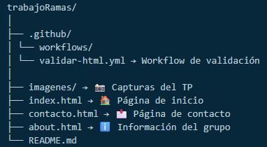
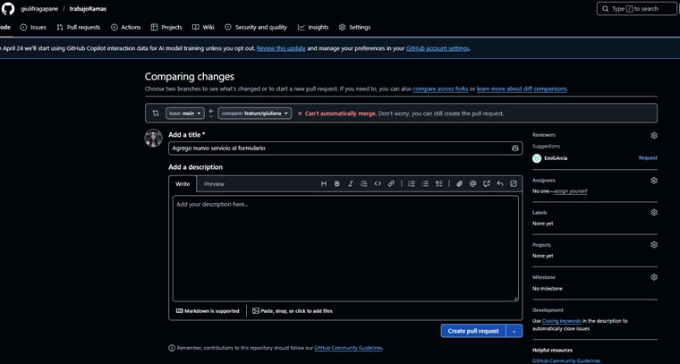
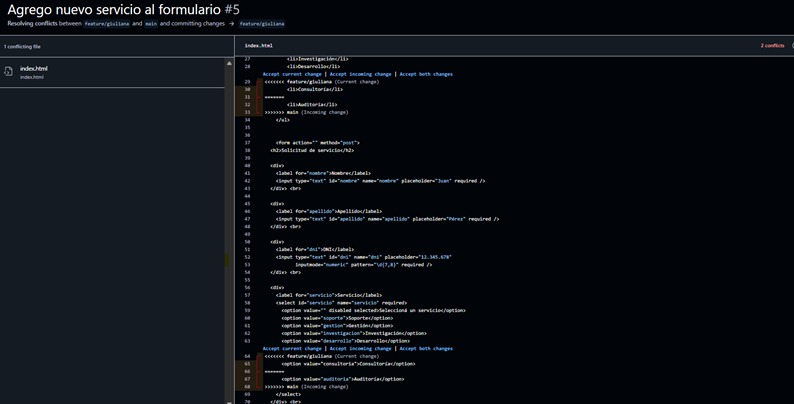
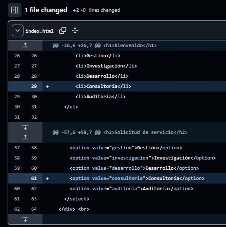
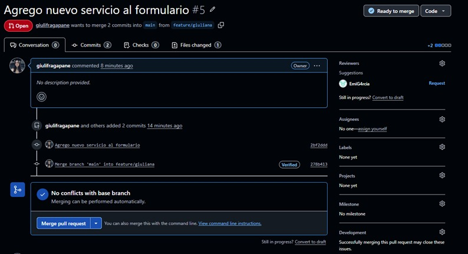
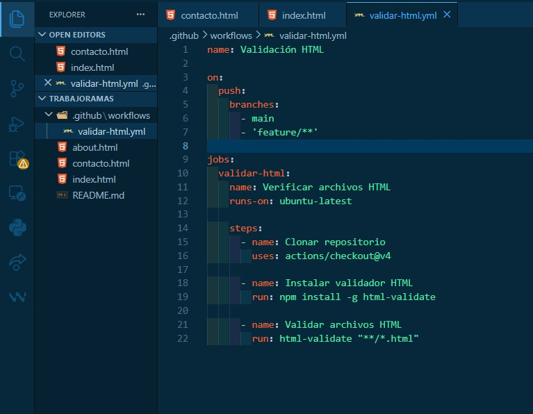
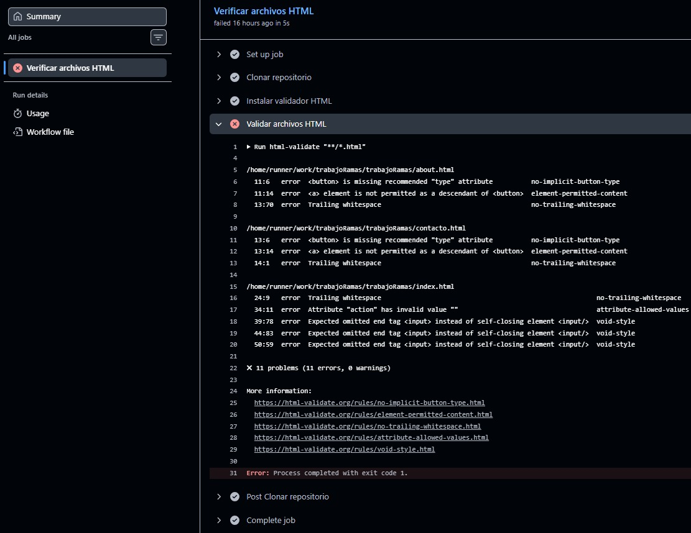
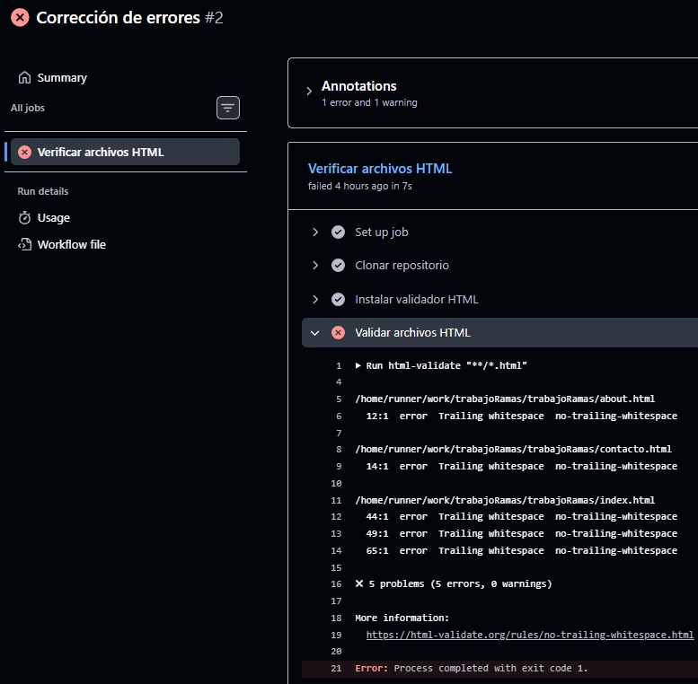
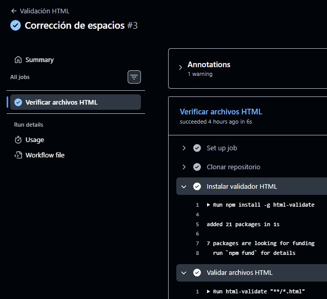
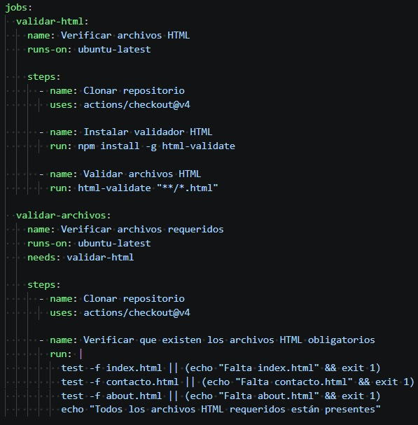

# 🌐 Trabajo Práctico - Git y GitHub

## 📚 Tecnicatura Universitaria en Programación

---

## 👥 Integrantes
- Pablo Barrios
- Emiliano García
- Giuliana Fragapane

---

## 📝 Descripción del Proyecto

Este proyecto consiste en el desarrollo de una aplicación web en **HTML puro**, cuyo objetivo principal es practicar:

- ✔ Uso de versiones con **Git**
- ✔ Trabajo colaborativo con **ramas**
- ✔ Resolución de **conflictos**
- ✔ Automatización con **GitHub Actions**

⚠️ El foco NO está en el diseño, sino en el uso correcto de herramientas de control de versiones.

---

## 🧱 Estructura del Proyecto

---

## 🌿 Ramas del Proyecto

- main → Rama principal
- feature/giuliana
- feature/pablo
- feature/emiliano

Cada integrante trabajó en su propia rama y luego integró sus cambios mediante merge.

---

## 📸 Evidencias

El repositorio incluye capturas de:

- ✔ Conflicto de merge
- ✔ Resolución del conflicto
- ✔ Ejecución del workflow (éxito y error)
- ✔ Creación de tags

---

## ⚔️ Conflicto de Merge

Se generó un conflicto de forma intencional modificando las **mismas líneas de un archivo HTML** desde distintas ramas.

### 🔴 Proceso:
1. Dos ramas modificaron el mismo archivo (`index.html`)
2. Se intentó hacer merge a `main`
3. Git detectó conflicto

### 🟡 Resolución:
- Se editaron manualmente las diferencias (mantuvimos ambos cambios)
- Se eliminaron los marcadores de conflicto
- Se realizó commit de resolución

📸 Se incluyen capturas del conflicto y su resolución.
- Captura 1 - Intento de merge a main.

- Captura 2 - Se modificaron las mismas líneas.

- Captura 3 - Se mantuvieron ambos cambios.

- Captura 4 - Merge final sin errores.

---

## 🤖 GitHub Actions (Validación Automática)

### Primera Versión Funcional

Se implementó un workflow que se ejecuta automáticamente en cada `push`.
- Archivo .yml básico para validación de HTML.

#### 📊 Resultados Esperados:
- ✔ HTML válido → Workflow exitoso  
- ❌ HTML inválido → Workflow falla

#### Workflow en Ejecución: 

- Intento 1: Se ejecuta el primer workflow en la pestaña de Actions, y da error (no se valida el archivo HTML).

- Intento 2: Como consecuencia, se analizan los errores señalados y se corrigen algunos. Se pushean cambios nuevamente, y el workflow en ejecución vuelve a dar error.

- Intento Final: Los errores pendientes son corregidos, logrando así que la validación sea llevada a cabo con éxito.

### Versión Final

Se agrega un job extra al archivo .yml de validación automática, con el fin de ampliar las funcionalidades. Se pasa de tener sólo el job `validar-html` a tener también el job `validar-archivos`.

- Archivo .yml ampliado para validación de HTML

### 🔎 Funcionalidades:
- ✔ Verificación de archivos HTML  
- ✔ Validación de estructura (etiquetas, cierre, sintaxis)  
- ✔ Comprobación de existencia de archivos obligatorios  
- ✔ Ejecución automática en ramas `main` y `feature/*`
- ✔ Verificación de archivos HTML  
- ✔ Validación de estructura (etiquetas, cierre, sintaxis)  
- ✔ Comprobación de existencia de archivos obligatorios  
- ✔ Ejecución automática en ramas `main` y `feature/*`
---

## 🏷️ Versionado con Tags

Se utilizaron tags para marcar versiones del proyecto:
- `v1.0.0` → Primera versión funcional

- `v1.1.0` → Versión final

📌 Permite acceder a distintas versiones del proyecto en GitHub.

---

## 📌 Lo aprendido

Este trabajo permitió comprender el flujo de trabajo real en equipo utilizando Git, incluyendo manejo de ramas, resolución de conflictos y automatización de validaciones.